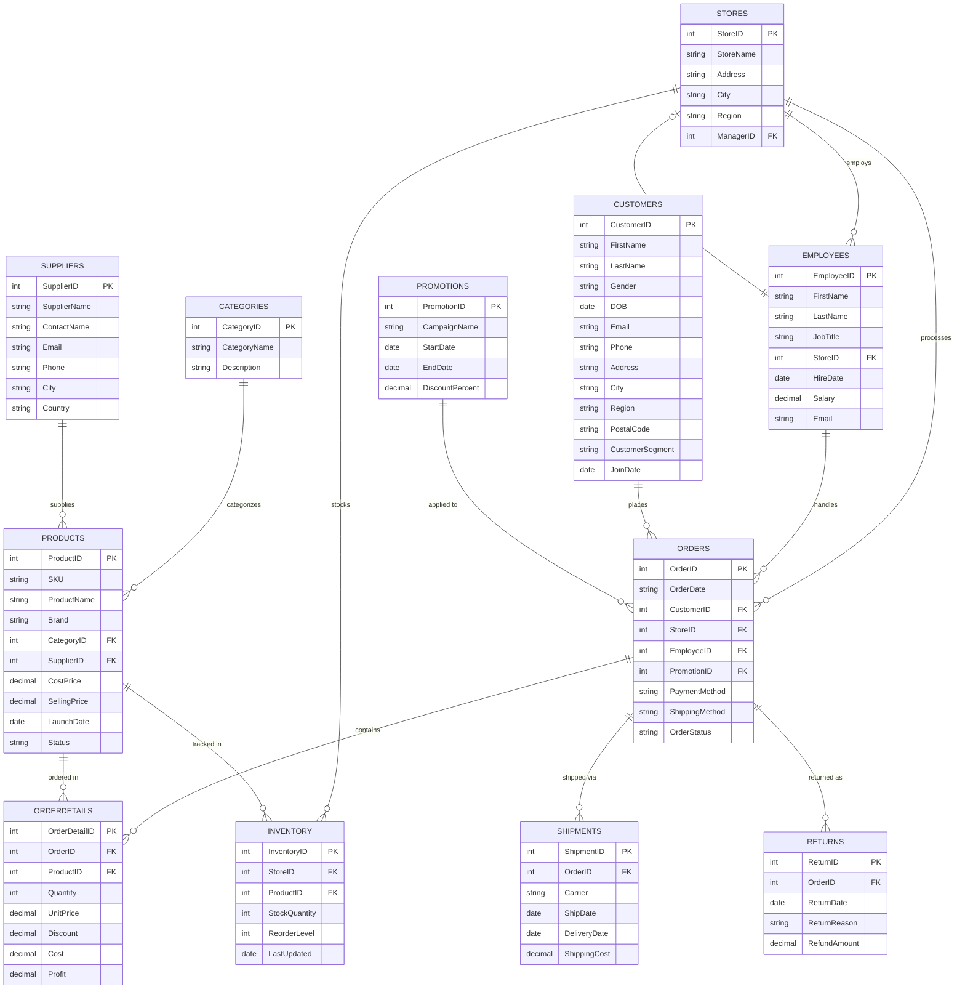

# RetailHub Ltd — Entity Relationship Diagram

This diagram uses [Mermaid](https://mermaid.js.org/) syntax and renders automatically
on GitHub. If you'd like a static image instead, paste this code block into the
[Mermaid Live Editor](https://mermaid.live) and export as PNG/SVG.

