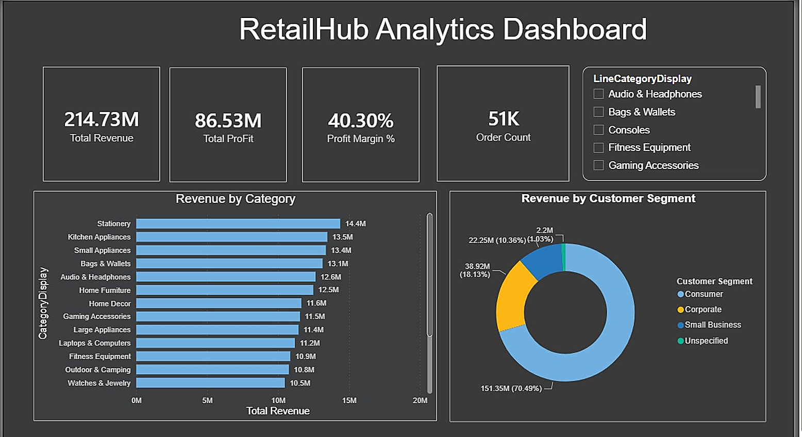
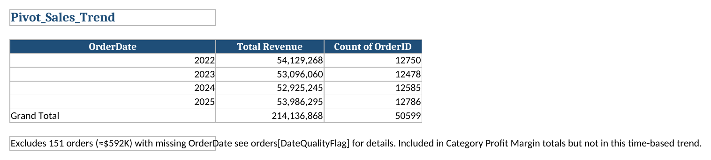
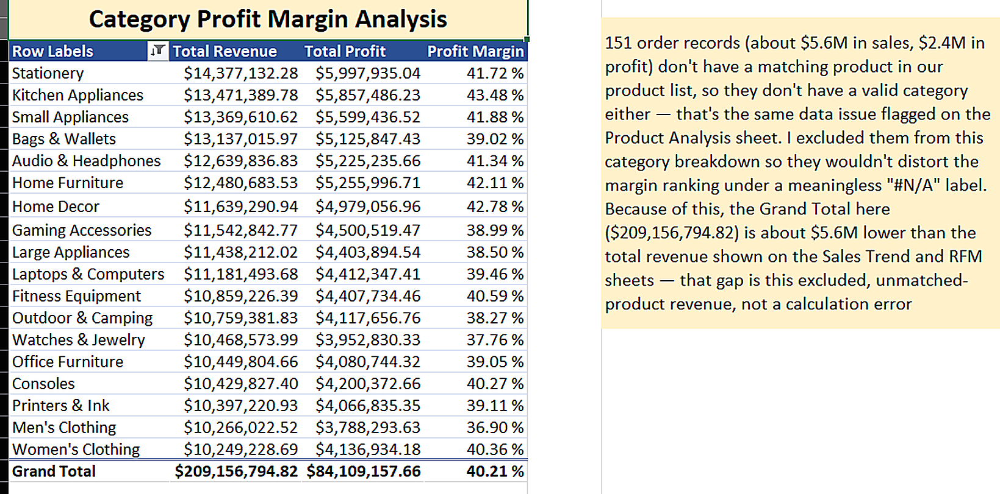
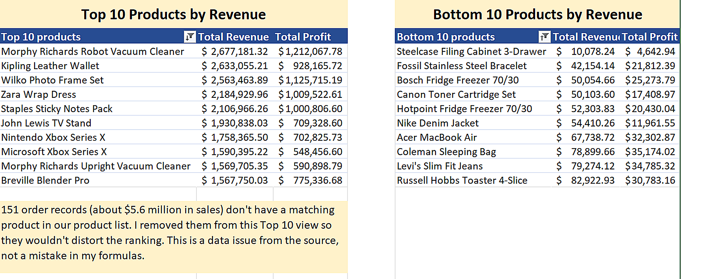
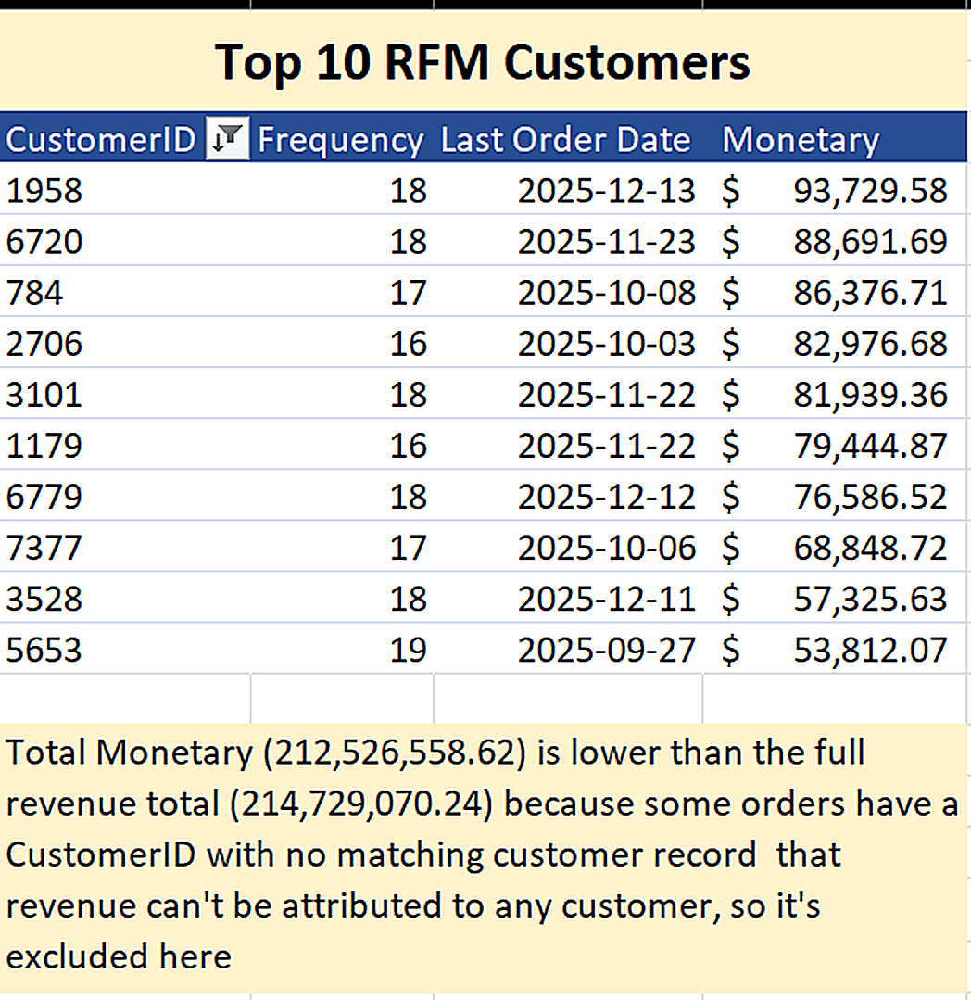

# RetailHub Analytics

**End-to-end data analytics project** using synthetic retail data (12 tables, ~50k orders).
**Pipeline:** Data Cleaning → SQL Business Analysis → Excel → Power BI


---

## Status

✅ **Data Cleaning Complete** — 12 tables cleaned & validated ([details](SQL/Data_cleaning/README.md))
✅ **SQL Analysis Complete** — 4 production-ready analysis files
✅ **Excel Analysis Complete** — 4 pivot table sheets over structured source data
✅ **Power BI Complete** — interactive dashboard

---

## Dashboard Preview



---

## Project Structure

```
retailhub_Analysis/
├── Screenshots/
│   ├── dashboard-overview.png            # Power BI dashboard preview
│   ├── excel-sales-trend.png             # Excel: Pivot_Sales_Trend
│   ├── excel-category-profit-margin.png  # Excel: Pivot_Category_Profit_Margin
│   ├── excel-product-analysis.png        # Excel: Pivot_Product_Analysis
│   └── excel-rfm-customers.png           # Excel: Pivot_RFM_Customers
├── Data/
│   ├── Raw_Data/                # Original synthetic CSVs (12 tables)
│   ├── Cleaned_Data/            # Post-cleaning exports
│   └── Documentation/           # Data dictionary & profiling
├── SQL/
│   ├── Data_Cleaning/           # Cleaning & validation scripts
│   └── Business_Analysis/
│       ├── 01_Overall_Performance.sql  # KPIs & business health
│       ├── 02_Sales_Trends.sql        # Growth & seasonality (MoM analysis)
│       ├── 03_Product_Analysis.sql    # Product performance & ranking
│       └── 04_Customer_Analysis.sql   # RFM segmentation & VIP identification
├── Excel/
│   └── RetailHub_Analysis.xlsx   # Pivot tables (Sales Trend, Category Profit Margin, Product Analysis, RFM Customers) over 6 structured source tables
└── PowerBI/
    └── RetailHub_Dashboard.pbix  # Interactive sales, product & customer dashboard
```

---

## SQL Analysis Summary

| File | Focus | Key Queries | Techniques Used |
|------|-------|------------|-----------------|
| **01_Overall_Performance** | Business KPIs | Total revenue, orders, avg order value | Data quality checks, subqueries |
| **02_Sales_Trends** | Growth trajectory | Monthly revenue, MoM growth %, seasonal patterns | LAG(), window functions, CTEs |
| **03_Product_Analysis** | Revenue drivers | Top 10 products/categories, profit margins, dead stock | DENSE_RANK(), LEFT JOIN, complex aggregations |
| **04_Customer_Analysis** | Customer value & segmentation | Top customers, RFM analysis (Recency/Frequency/Monetary) | DATEDIFF(), CASE WHEN, 3-table joins |

---

## Excel Analysis

`RetailHub_Analysis.xlsx` — pivot tables built directly on six formatted source tables (`orderdetails`, `orders`, `returns`, `customers`, `categories`, `products`):

**Pivot_Sales_Trend** — Total Revenue and Order Count by year.



**Pivot_Category_Profit_Margin** — Total Revenue, Total Profit, and Profit Margin % by category.



**Pivot_Product_Analysis** — Top 10 and Bottom 10 products by revenue.



**Pivot_RFM_Customers** — Top 10 customers by Frequency, Last Order Date, and Monetary value.



> **Note:** the Excel pivots independently surface the same data quality issues found in Power BI. The RFM pivot excludes 506 orders (~2.2M in revenue) with a `CustomerID` that has no matching customer record — footnoted directly on the sheet rather than left as an unlabeled row, matching the finding fixed in the Power BI dashboard (see Data Quality below). The Product Analysis and Category Profit Margin pivots consistently exclude the same 151 order records (~$5.6M in sales, ~$2.4M in profit) that have no matching product — both sheets are footnoted with the exact dollar gap this creates against the Sales Trend / RFM grand totals, so the numbers reconcile rather than silently disagreeing.

---

## Power BI Dashboard

**"RetailHub Analytics Dashboard"** (`RetailHub_Dashboard.pbix`) — an interactive report built on the cleaned SQL data, including:

- **KPI cards** — Total Revenue, Total Profit, Profit Margin %, and Order Count at a glance.
- **Revenue by Category** — horizontal bar chart ranking product categories by revenue.
- **Revenue by Customer Segment** — donut chart breaking revenue down by Consumer / Corporate / Small Business.
- **Interactive slicer** — filter the whole page by product category.
- **Data quality handling** — rather than letting broken relationships silently show as unlabeled "(Blank)" slices, calculated columns (DAX `RELATED()` + `ISBLANK()`) explicitly label orphaned records as "Unspecified" / "Uncategorized" (see Data Quality findings below).

---

## Key Findings

### Data Quality
- **750 orders** have no matching OrderDetails (phantom orders)
- **151 orders** have NULL OrderDate ($617k revenue impact)
- **506 orders** have no matching customer record (~2.2M revenue, 1.03% of total) — surfaced as an unlabeled "(Blank)" segment in Power BI until traced to orphaned `CustomerID` values and relabeled "Unspecified" via a DAX calculated column
- **Orphaned order-line products** — some `orderdetails` rows reference a `ProductID` not present in the `products` table, causing a "(Blank)" category in revenue-by-category views; relabeled "Uncategorized" via DAX
- *Approach:* Documented & flagged, not deleted. All calculations account for these issues.

### Business Insights
- **Product Performance:** Profit margins range 15.72%–53.58% (3x variance worth investigating)
- **Customer Base:**
  - 20% ACTIVE (bought last 6 months)
  - 30% AT-RISK (6–12 months since purchase)
  - 50% DORMANT (12+ months inactive)
- **Segment Spending:** Corporate ≈ Consumer spending — no significant difference

---

## Skills Demonstrated

✅ Joins (INNER, LEFT, multi-table chains)
✅ Window Functions (LAG, DENSE_RANK with PARTITION BY)
✅ CTEs & Subqueries (multi-stage complex queries)
✅ Aggregation & Filtering (GROUP BY, HAVING, CASE WHEN)
✅ Date Functions (DATEDIFF, YEAR, MONTH, DATE_SUB)
✅ Data Quality Validation & Documentation
✅ Pivot Table Analysis (Excel)
✅ Interactive Dashboard Design & DAX (Power BI)
✅ Relationship-Level Data Quality Fixes (DAX `RELATED()`, `ISBLANK()`, Power Query Left Anti merges)

---

## Tools & Stack

- **Database:** MySQL Workbench
- **Data Generation:** Python (Faker library)
- **Reporting:** Excel (Pivot Tables), Power BI (Dashboards)
- **Version Control:** Git & GitHub

---

## How to Use

1. Clone the repository
2. Connect to your MySQL database
3. Run cleaning scripts in `SQL/Data_Cleaning/`
4. Execute queries in `SQL/Business_Analysis/` for insights
5. Open `Excel/RetailHub_Analysis.xlsx` to explore the pivot table sheets
6. Open `PowerBI/RetailHub_Dashboard.pbix` in Power BI Desktop for the interactive dashboard

---

## License

This project is licensed under the [MIT License](LICENSE) — free to use, modify, and share.

---

## Author

**Naima Abdi** — Data Analyst
📊 SQL | Excel | Power BI
🔗 [GitHub](https://github.com/naima-abdii26/retailhub-analytics)

---

**Last Updated:** August 19, 2026
